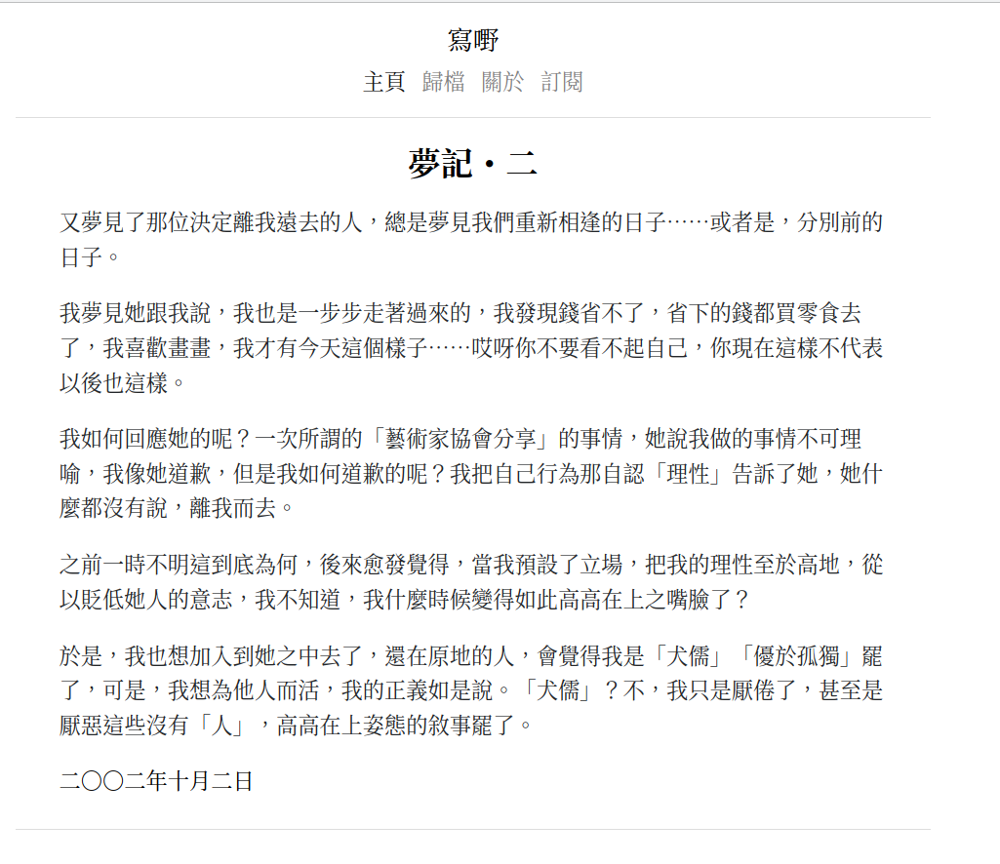

# Seje2



## Contents

- [Installation](#installation)
- [Options](#options)
  - [Top menu](#top-menu)
  - [Author](#author)

## Installation
First download this theme to your `themes` directory:

```bash
cd themes
git clone https://github.com/eatradish/Seje2
```
and then enable it in your `config.toml`:

```toml
theme = "Seje2"
```

This theme requires your index section (`content/_index.md`) to be paginated to work:

```toml
paginate_by = 5
```

The posts should therefore be in directly under the `content` folder.

## Options

### Top-menu
Set a field in `extra` with a key of `seje2_menu_links`:

```toml
seje2_menu_links = [
    {url = "$BASE_URL", name = "Home"},
    {url = "$BASE_URL/categories", name = "Categories"},
    {url = "$BASE_URL/tags", name = "Tags"},
    {url = "https://google.com", name = "Google"},
]
```

If you put `$BASE_URL` in a url, it will automatically be replaced by the actual
site URL.

### Author
You can set this on a per page basis or in the config file.

```
In a page (wrap this in +++):
```toml
title = "..."
date = 1970-01-01

[extra]
author = "John Smith"
```

